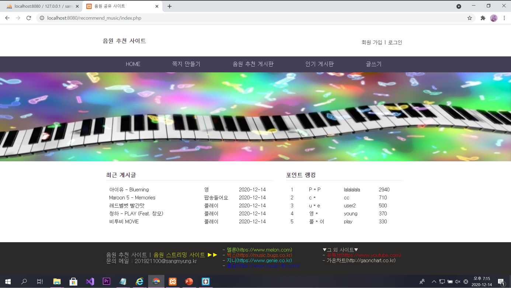
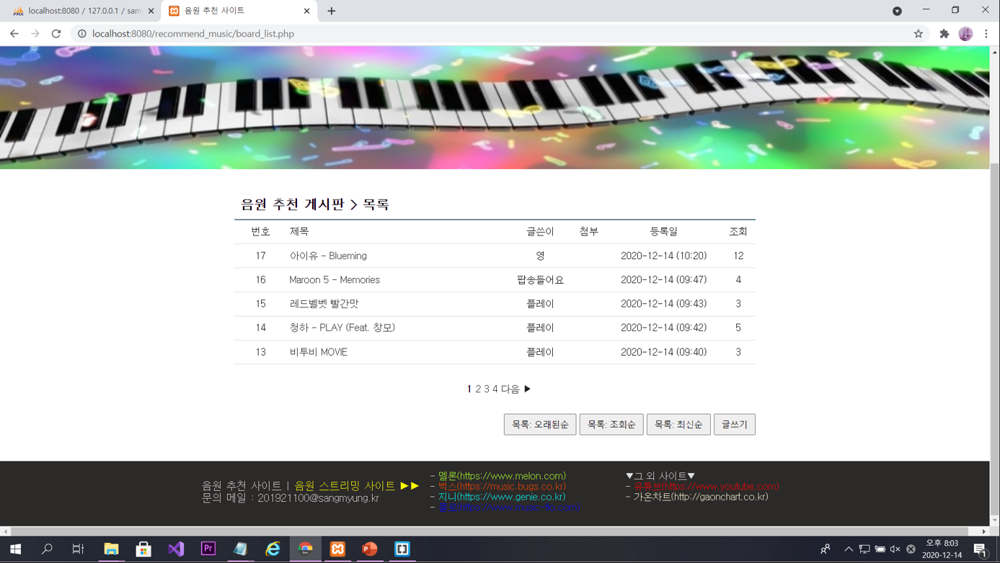

# 🎵 Music Recommendation Site

> PHP와 MySQL을 사용해 구현한 음원 추천 커뮤니티 웹사이트입니다.

**[Project] 음원 추천 사이트 (PHP)**  
2020년 2학기 서버프로그래밍 기말 과제

---

## 📌 프로젝트 소개
PHP와 MySQL을 활용하여 구현한 **음원 추천 커뮤니티 웹사이트**입니다.  
회원 기반 게시판 구조로, 게시글·댓글·추천(좋아요)·인기 게시판 기능을 포함합니다.

---

## 📌 프로젝트 기획 배경
평소 음원을 자주 듣고 다양한 음원 스트리밍 서비스를 이용하며,  
사용자들이 직접 음원을 추천하고 소통할 수 있는 사이트를 만들어보고자 본 프로젝트를 기획하였습니다.

게시글의 추천 수에 따라 **인기 게시판으로 자동 이동**하는 구조와,  
게시글 내에서 **YouTube 뮤직비디오를 함께 재생**할 수 있도록 설계하였습니다.

---

## 🧩 사이트 구조
공통 레이아웃을 분리하여 유지보수성을 고려해 구성하였습니다.

- **header.php** : 메뉴, 로그인/회원가입, 게시판 이동
- **main.php** : 메인 이미지, 최근 게시글, 포인트 랭킹
- **footer.php** : 문의 메일 및 외부 음원 스트리밍 사이트 링크

---

## 🛠️ 주요 기능

### 👤 회원 기능
- 회원가입 / 로그인 (세션 기반)
- 회원 정보 수정
- 쪽지 송수신
- 관리자 모드 지원

### 📝 게시판 기능
- 음원 추천 게시판 (게시글 작성 / 수정 / 삭제)
- 게시글 정렬 기능
  - 최신순
  - 조회순
  - 오래된순
- 게시글 내 YouTube 영상 재생
- 첨부파일 업로드 지원

### 💬 댓글 기능
- 댓글 작성
- 댓글 목록 페이징 (10개 단위)
- 로그인 사용자만 댓글 작성 가능

### ❤️ 추천(좋아요) 기능
- 게시글 추천 / 추천 취소
- 사용자당 1회 제한
- 추천 상태 DB 저장으로 유지
- 추천 수 10개 이상 시 인기 게시판 자동 등록

### 🔐 권한 제어
- 작성자와 로그인 아이디가 일치하지 않을 경우
  - 게시글 수정 / 삭제 불가
- 인기 게시판에서는 수정 / 삭제 비활성화

---

## 🗄️ 데이터베이스 설계
총 **5개의 테이블**을 사용하였습니다.

| 테이블명 | 설명 |
|--------|------|
| board | 게시글 정보 |
| love | 추천(좋아요) 정보 |
| reply | 댓글 정보 |
| members | 회원 정보 |
| message | 쪽지 송수신 정보 |

---

## 🖼️ 실행 화면 (스크린샷)
아래는 실제 구현 화면 일부입니다.

---

## 🧪 사용 기술 
- Backend : PHP
- Database : MySQL
- Frontend : HTML / CSS
- Tool : phpMyAdmin

---

## 📄 참고 
본 프로젝트는 상명대학교 스마트정보통신공학과 2학년 서버프로그래밍 기말고사 과제로 제작되었습니다.
학습 목적의 개인 프로젝트이며, 실제 상용 서비스는 아닙니다.
